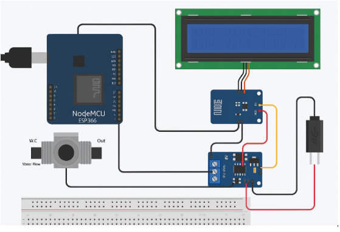
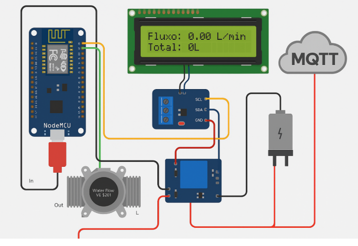
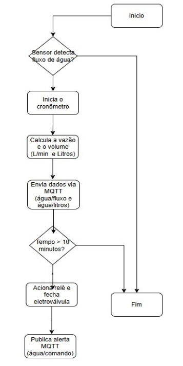

# 💧 Projeto Uso Consciente da Água

Sistema inteligente para controle de consumo de água no chuveiro, baseado em IoT. Mede a vazão, conta o tempo e desliga automaticamente após 10 minutos. Os dados são enviados via MQTT para um broker na nuvem.

---

## 🚀 Funcionamento

- Monitora o tempo e o fluxo da água.
- Exibe informações no display LCD.
- Desliga automaticamente após 10 minutos.
- Permite controle remoto via MQTT (comandos ligar/desligar).
- Publica dados de fluxo (L/min) e volume total (litros).

---

## 🧠 Tecnologias

- NodeMCU ESP8266
- Sensor de fluxo YF-S201
- Display LCD 16x2 I2C
- Módulo Relé 5V + Eletroválvula 12V
- MQTT (Broker Mosquitto ou HiveMQ)

---

## 📡 Comunicação MQTT

| Publicações         | Descrição                        |
|---------------------|----------------------------------|
| `agua/fluxo`        | Vazão em L/min                   |
| `agua/litros`       | Volume total acumulado (litros)  |

| Assinatura          | Comando                          |
|---------------------|----------------------------------|
| `agua/comando`      | `ligar` ou `desligar`            |

---

## 🛠️ Documentação

- 🔗 [Hardware](docs/hardware.md)
- 🔗 [Comunicação MQTT](docs/comunicacao_mqtt.md)
- 🔗 [Instruções de Execução](docs/instrucoes_execucao.md)

---

## 🖼️ Imagens

## 🔧 Esquema de Montagem

---

## 🧰 Protótipo Montado

---

## 🔄 Fluxograma de Funcionamento

---

## 👨‍💻 Equipe

- Ana Júlia Real Costa
- Gabriela dos Reis Barreto
- Lucas Diniz Fabbri

Universidade Presbiteriana Mackenzie – 2025
