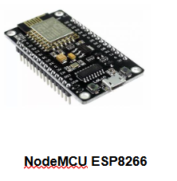
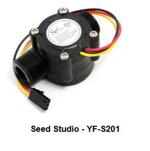
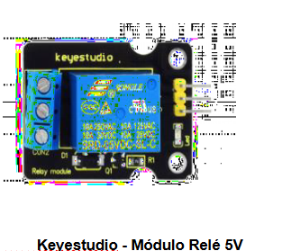
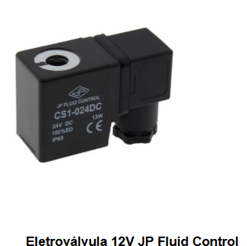
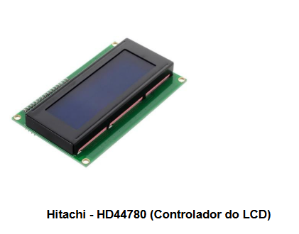

# 🔧 Documentação do Hardware

## 💡 Descrição Geral

Este sistema é composto por um microcontrolador ESP8266 (NodeMCU), sensores, atuadores e uma interface de usuário via display LCD. Seu objetivo é monitorar o consumo de água no chuveiro e realizar o controle automático do tempo de uso, além de fornecer dados via internet utilizando MQTT.

---

## 🧰 Componentes Utilizados

| Componente               | Função                                   | Observações                        |
|--------------------------|------------------------------------------|-------------------------------------|
| ESP8266 NodeMCU          | Microcontrolador principal               | Conexão Wi-Fi e controle geral     |
| Sensor de Fluxo YF-S201  | Medição da vazão de água                 | Conectado no pino D5               |
| Módulo Relé 5V           | Acionamento da eletroválvula             | Conectado no pino D4               |
| Eletroválvula 12V        | Controla o fluxo de água                 | Abre/fecha a passagem da água      |
| Display LCD 16x2 (I2C)   | Interface visual para exibir dados       | Endereço I2C: 0x27                 |
| LED (Simulado no Wokwi)  | Representa o relé na simulação           | Opcional na simulação              |
| Fonte 12V                | Alimentação da eletroválvula             | Necessária no hardware físico      |

---

## 🔌 Esquema de Montagem

---

## 🧩 Visão dos Componentes

### 🟦 NodeMCU ESP8266  

---

### 🚰 Sensor de Fluxo YF-S201  

---

### ⚡ Módulo Relé 5V  

---

### 💧 Eletroválvula 12V  

---

### 🖥️ Display LCD 16x2 (I2C)  

---

## 🖨️ Peças Impressas em 3D (Opcional)

Caso deseje, é possível projetar:

- 🔹 **Caixa para acomodar o NodeMCU, relé e fonte.**
- 🔹 Suporte para o sensor de fluxo na tubulação.
- 🔹 Painel frontal para o display LCD.

---

## 📐 Dimensões Sugeridas

| Componente          | Dimensões Aproximadas           |
|---------------------|----------------------------------|
| NodeMCU             | 60mm x 30mm                     |
| Módulo Relé         | 50mm x 25mm                     |
| Display LCD         | 80mm x 36mm                     |
| Caixa Eletrônica    | 120mm x 90mm x 60mm (sugestão)  |
| Sensor de Fluxo     | 60mm x 35mm                     |

---

## 📸 Foto do Protótipo Montado  
*(Se disponível)*

---

## 🔗 Observações

- Na simulação via Wokwi, a válvula é representada por um LED.
- No hardware real, a eletroválvula requer uma fonte externa de 12V.
- O relé deve ser dimensionado para suportar a corrente da válvula.
